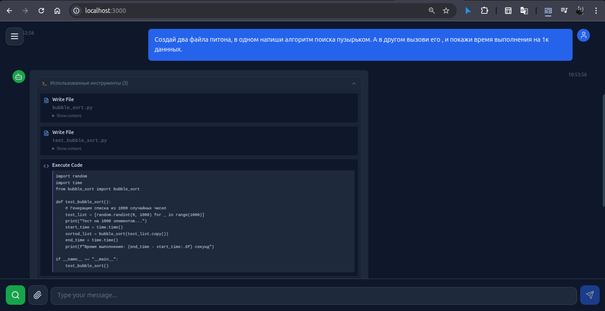
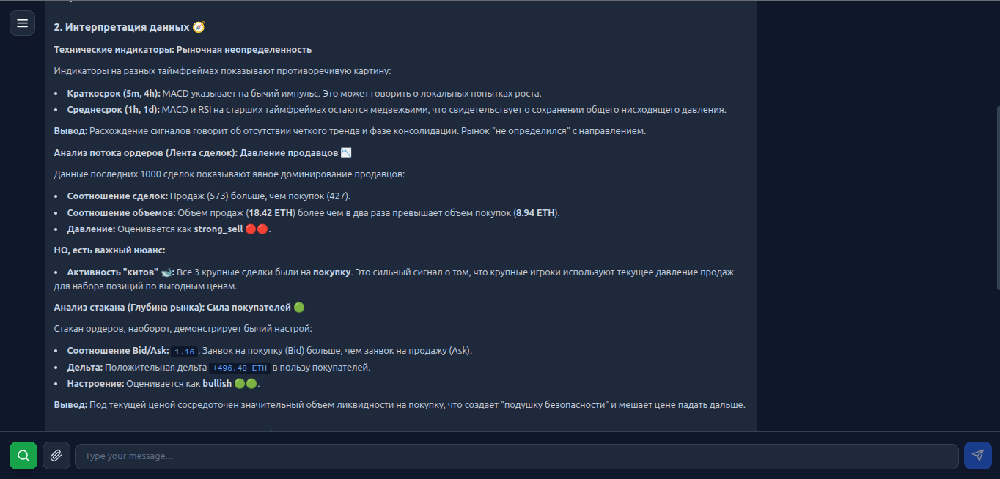

# 🤖 Multi-Agent AI Router

[](https://www.python.org/downloads/)
[](https://www.typescriptlang.org/)
[](https://www.docker.com/)
[](https://opensource.org/licenses/MIT)

**Модульная платформа AI-агентов с поддержкой нескольких LLM-провайдеров.**

> 📚 *Это демо-проект в образовательных и исследовательских целях.*

🇬🇧 [English version](README.md)

---

## 🎯 В чём крутость

| Фича | Описание |
|------|----------|
| **🔌 Plug & Play LLM** | Переключайтесь между Gemini, OpenRouter или любым OpenAI-совместимым API |
| **🧩 Модульные агенты** | Каждый агент независим — добавьте свой за минуты |
| **🛠️ Реальное выполнение** | Агенты не просто болтают — они *делают*: ищут, кодят, анализируют |
| **📊 Live крипто-данные** | Интеграция с Binance API — цены, стакан, сделки в реальном времени |
| **🐳 Docker Sandbox** | Выполнение кода в изолированных контейнерах — безопасно и воспроизводимо |
| **⚡ Native Tool Calling** | Gemini 2.5 Pro использует нативные вызовы функций |

---

## 🤖 Агенты

### 🔍 Dialog Agent
*Интеллектуальный диалоговый агент с веб-возможностями*

- **Умный поиск** — Мульти-источниковый поиск с агрегацией результатов
- **Чтение страниц** — Извлечение и суммаризация контента с любого URL
- **Осведомлённость о контексте** — Сохраняет историю диалога и состояние сессии

---

### 🧠 Coder Agent
*Полнофункциональный ассистент для кодинга, который реально выполняет код*



- **Файловые операции** — Создание, чтение, листинг файлов в изолированном workspace
- **Выполнение кода** — Запуск Python в Docker песочнице
- **Многофайловые проекты** — Импорт между файлами, создание полноценных проектов
- **Native Tool Calling** — Gemini 2.5 Pro использует нативные вызовы функций
- **Индикатор поддержки** — ✅/⚠️ показывает какие модели поддерживают native tools

**Пример:**
```
Пользователь: Посчитай числа Фибоначчи до 100

Агент: Создам и запущу Python скрипт.
[Создаёт fibonacci.py → Выполняет → Возвращает результат]

Вывод: [1, 1, 2, 3, 5, 8, 13, 21, 34, 55, 89]
```

---

### 📊 Crypto Analyst Agent v2.0
*Профессиональный криптоаналитик с данными Binance в реальном времени*



**Данные в реальном времени с Binance API:**
- 💰 **Цена и свечи** — Текущая цена, изменение 24h, мульти-таймфрейм
- 📈 **12 индикаторов** — RSI, MACD, EMA, Bollinger, StochRSI, ADX, ATR, VWAP, OBV, Ichimoku, SuperTrend, CMF
- 📊 **Анализ стакана** — Дельты на 7 уровнях (1.5%, 3%, 5%, 15%, 30%, 60%, 90%)
- 🔄 **Поток сделок** — Buy/sell давление, активность китов, скорость, распределение по размерам
- 📉 **Фьючерсы** — Funding Rate, Open Interest, Long/Short Ratio
- 🎯 **Smart Money Concepts** — FVG, Order Blocks, структура рынка (HH/HL/LL/LH), зоны ликвидности
- 🗓️ **Multi-Timeframe** — Анализ на 3 горизонтах (краткосрок/среднесрок/долгосрок)
- 📊 **Анализ объёмов** — Volume Delta, Relative Volume, Volume Profile (POC, VAH, VAL)
- 😨 **Рыночный контекст** — Fear & Greed Index, капитализация рынка

**Модульные запросы:**
```
"анализ BTC"      → Полный анализ
"индикаторы ETH" → Только технический анализ
"стакан SOL"      → Анализ стакана
"smc BTC"         → Smart Money Concepts
"настроение ETH"  → Fear&Greed + Funding Rate
"объём SOL"       → Анализ объёмов
"mtf BTC"         → Multi-Timeframe
```

---

## 🏗️ Архитектура

```
┌─────────────┐     ┌──────────────┐     ┌─────────────────┐
│   Frontend  │────▶│   FastAPI    │────▶│   LLM Provider  │
│   (React)   │     │   (routes)   │     │ Gemini/OpenRouter│
└─────────────┘     └──────────────┘     └─────────────────┘
                           │
                    ┌──────┴──────┐
                    ▼             ▼
              ┌─────────┐   ┌─────────┐
              │  Agent  │   │ Session │
              │ Dialog/ │   │ Manager │
              │ Coder/  │   └─────────┘
              │ Crypto  │
              └────┬────┘
                   ▼
              ┌─────────┐
              │  Tools  │
              │ search/ │
              │ files/  │
              │ code/   │
              │ crypto  │
              └─────────┘
```

---

## 🔐 Безопасность

Проект реализует несколько уровней защиты для выполнения кода:

| Уровень | Защита |
|---------|--------|
| **🐳 Sandbox контейнер** | Код выполняется в изолированном Docker контейнере без доступа к сети |
| **📁 Валидация путей** | Все файловые операции ограничены workspace сессии |
| **⏱️ Ресурсные лимиты** | Ограничения CPU, памяти и timeout |
| **👤 Non-root пользователь** | Sandbox работает от непривилегированного пользователя |

> ⚠️ **Дисклеймер**: Это демонстрационный проект. Для production рекомендуется дополнительная защита (gVisor, Firecracker и т.д.)

### ⚠️ Известные ограничения

| Проблема | Описание | Статус |
|---------|----------|--------|
| **Sandbox Fallback** | При недоступности sandbox код может выполниться локально | ⚠️ TODO |
| **Context Window** | Длинные диалоги могут превысить лимит токенов (нет RAG) | Demo scope |
| **Regex JSON Fallback** | Legacy для моделей без native tool calling | Используй Gemini 2.5 |

---

## 🚀 Быстрый старт

```bash
git clone https://github.com/nssanta/Multi-Agent-Router.git
cd Multi-Agent-Router
cp .env.example .env
# Добавьте API ключи в .env
docker compose up --build
```

Открыть: **http://localhost:3000**

---

## ⚙️ Конфигурация

```env
# Обязательные
GEMINI_API_KEY=your_gemini_key
OPENROUTER_API_KEY=your_openrouter_key

# Опциональные
LLM_PROVIDER=gemini          # или openrouter
LLM_MODEL=gemini-2.5-pro     # модель по умолчанию
```

---

## 🔧 Расширение системы

### Добавить нового агента

```python
# backend/agents/my_agent/agent.py
def create_my_agent(llm_provider, session_path):
    return Agent(
        name="my_agent",
        llm_provider=llm_provider,
        instruction="Ваш кастомный промпт",
        tool_definitions=[...],
    )
```

### Добавить новый инструмент

```python
# backend/tools/my_tool.py
def my_tool(param: str) -> str:
    """Описание инструмента для LLM"""
    return f"Result: {param}"
```

---

## 📁 Структура проекта

```
backend/
├── agents/           # Dialog, Coder, Crypto агенты
│   ├── dialog/       # Диалоговый агент
│   ├── coder/        # Агент выполнения кода
│   └── crypto/       # Криптоаналитик
├── api/              # FastAPI роуты
├── core/             # LLM провайдеры, сессии, executor
└── tools/            # Инструменты агентов
    ├── web/          # Поиск, чтение страниц
    └── crypto/       # Binance API, индикаторы

frontend/
├── src/components/   # React компоненты
└── src/services/     # API клиент
```

Полная техническая документация: [TECHNICAL_DOCS.md](TECHNICAL_DOCS.md)

---

## 📄 Лицензия

MIT
